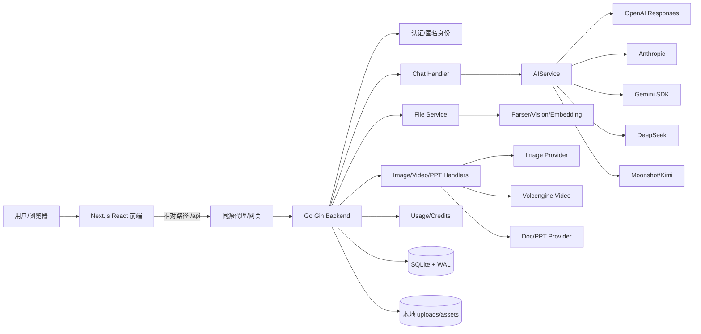
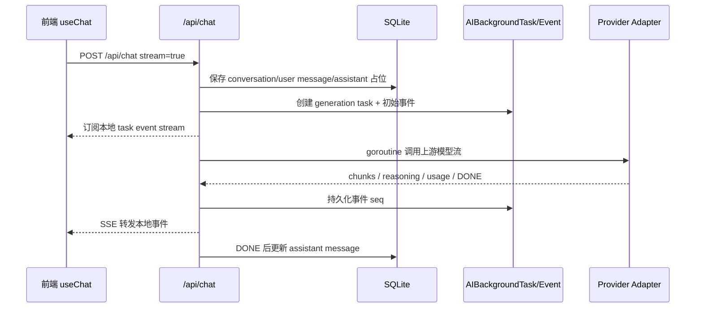
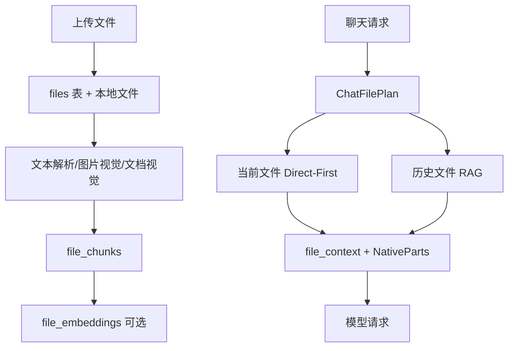

# AI Pool 总架构

## 一、系统定位

AI Pool 是一个面向多模型、多模态与生产力场景的 AI 工作台。当前系统不是单一聊天壳，而是由以下能力组成：

- 多模型聊天：OpenAI、Anthropic、Gemini、DeepSeek、Moonshot 等 Provider 统一接入。
- 流式生成：通过本地任务事件层承接上游 SSE，支持消息落库、刷新恢复、取消与后台任务。
- 文件智能：上传、解析、视觉兜底、Direct-First 原文件直传、历史文件 RAG。
- 创作能力：图片生成/编辑、视频生成、图片/视频会话、历史资产管理。
- 文档生产力：PPT 生成、提纲确认、幻灯片改写、配图生成、导出。
- 商业化基础：用户、匿名访问、额度、套餐、用量日志、限流。

## 二、总体模块图

## 三、后端分层

| 层 | 目录/组件 | 责任 |
|---|---|---|
| HTTP/API | `backend/internal/api` | 路由、参数校验、认证上下文、响应格式、SSE 输出 |
| Service | `backend/internal/services` | AI Provider、文件解析、检索、图片/视频/PPT、用量计算 |
| Model | `backend/internal/models` | GORM 模型、SQLite 初始化、迁移、索引 |
| Middleware | `backend/internal/middleware` | JWT、可选认证、IP 限流 |
| Config | `backend/internal/config` | Provider Key、价格、端口、存储目录、开关 |
| Skills | `backend/internal/skills` | 技能加载、匹配、注入 |

核心入口是 `NewRouter(db, cfg)`：初始化 AIService、SearchService、FileService、RetrievalService、UsageService，然后注册公开路由、可选认证路由和强认证路由。

## 四、前端分层

| 层 | 目录/组件 | 责任 |
|---|---|---|
| App Router | `frontend/app` | 页面路由：聊天、技能、创作、工作区、设置、登录注册 |
| Feature Components | `frontend/components/chat|creative|sidebar|skills` | 功能 UI 组合与交互 |
| Hooks | `frontend/hooks` | 聊天、模板、数据请求、流式状态封装 |
| Lib | `frontend/lib` | streaming store、i18n、工具函数、guest id、状态辅助 |
| UI Components | `frontend/components/ui` | 弹窗、确认框、历史抽屉、Lightbox 等通用 UI |

前端通过相对路径访问 `/api`，默认由同域代理到后端；不应在客户端硬编码后端域名。

## 五、主链路

### 5.1 聊天链路

### 5.2 文件链路

### 5.3 媒体/文档链路

- 图片：创建任务 → 调用图片服务 → 保存本地图片资产 → 记录历史 → 前端历史面板展示。
- 视频：创建远端任务 → 前端轮询/刷新状态 → 成功后拉取远端视频并本地化 → 记录历史。
- PPT：创建 PPT 记录 → 生成提纲 → 用户确认 → 生成 slides/配图 → 改写/重绘 → 导出。

## 六、关键设计原则

1. **Provider 差异关在 Adapter 内部**：业务层只认 `UnifiedAIRequest`，不要让 ChatHandler 感知 OpenAI/Gemini/DeepSeek 的细节。
2. **流式输出先本地任务化**：前端订阅本地 task events，而不是直接依赖上游连接；刷新、断线、后台任务都能恢复。
3. **当前文件优先**：本轮上传文件优先 Direct-First，历史文件才走 RAG，避免上下文被旧文件污染。
4. **媒体资产本地化**：远端生成结果必须落本地，前端统一访问 `/api/images/file/*`、`/api/videos/file/*`。
5. **前端体验优先**：聊天、文件、创作页面必须减少闪烁、阻塞和重复渲染；复杂能力要隐藏在清晰状态后面。
6. **SQLite 单机优先但保留扩展边界**：当前适合轻量部署；后台任务、用量日志、文件向量是未来迁移 Postgres/对象存储/队列的天然边界。

## 七、总架构中的分架构入口

| 架构点 | 分文档 |
|---|---|
| 前端体验与性能 | `01-前端交互与性能架构.md` |
| 聊天消息与流式任务 | `02-聊天消息与流式生成架构.md` |
| 多模型 Provider 与解码 | `03-模型Provider与SSE解码架构.md` |
| 文件上传解析与 RAG | `04-文件上传解析与RAG架构.md` |
| 图片/视频媒体创作 | `05-创作媒体图片视频架构.md` |
| PPT 文档生成 | `06-PPT文档生成架构.md` |
| 账户、额度、用量 | `07-账户认证额度用量架构.md` |
| 数据存储、任务事件 | `08-数据存储与任务事件架构.md` |
| 部署、端口、网关 | `09-部署运行与网关架构.md` |
