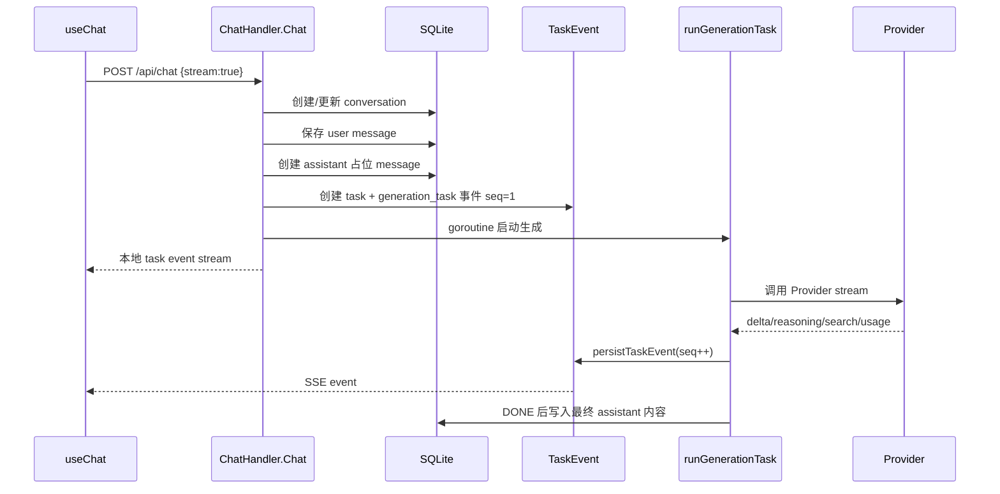

# 聊天消息与流式生成架构

## 一、定位

聊天架构是 AI Pool 的核心架构。它同时处理普通聊天、技能聊天、对比聊天、文件上下文、联网搜索、深度思考、后台任务和消息持久化。

## 二、核心组件

| 组件 | 文件 | 责任 |
|---|---|---|
| ChatHandler | `backend/internal/api/chat.go` | 聊天入口、消息保存、任务创建、SSE 输出 |
| AIService | `backend/internal/services/ai_service.go` | 选择 Provider Adapter 并发起模型请求 |
| Task/Event | `models.AIBackgroundTask/Event` | 本地任务与事件持久化 |
| useChat | `frontend/hooks/useChat.ts` | 前端聊天状态、SSE 解析、恢复、对比模式 |
| ChatInterface | `components/chat/ChatInterface.tsx` | 聊天页组合、模型/模板/对比/重命名 |
| MessageList | `components/chat/MessageList.tsx` | 消息列表渲染、滚动、加载更多 |

## 三、流式请求生命周期

## 四、为什么要本地任务事件层

旧式做法是 HTTP handler 直接连接上游模型，再把上游 SSE 原样转给前端。当前架构改为：handler 只创建本地任务和订阅，本地 goroutine 独立消费上游。

收益：

- 前端刷新后可以通过 task/message id 恢复。
- 上游断流、后台模型、搜索 meta、usage、DONE 可以统一落事件表。
- Assistant 占位消息先落库，用户离开后仍能看到生成状态。
- 取消任务、轮询、后台 retrieve 有统一入口。

成本：

- 事件顺序必须严格维护，`DONE` 必须最后。
- 前后端都要处理 `generation_task`、`search_meta`、delta、error、done 等事件。
- SQLite 写事件频率高，需要控制 flush/批量/降频。

## 五、消息分组与对比模式

对比聊天通过 `MessageGroup` 将同一轮用户问题下的多个 assistant 回答归为一组。

| 字段 | 含义 |
|---|---|
| `group_id` | 同一轮对比回答组 |
| `group_index` | 当前 assistant 在组中的位置 |
| `group_models` | 本轮参与对比的模型列表 |
| `user_message_id` | 对应的用户消息 |

前端通过 `groupViews` 控制当前展示哪个模型回答，避免把对比模式退化成普通消息列表堆叠。

## 六、文件与搜索的优先级

聊天请求进入模型前会先构建 `ChatFilePlan`：

1. 当前消息文件优先。
2. 历史上下文文件补充。
3. 如果问题是文件相关，则跳过联网搜索，避免搜索结果污染文件问答。
4. 多个 system message 会合并，并按 `file_context > other > web_search_context` 的优先级排序。

## 七、前端恢复策略

| 策略 | 说明 |
|---|---|
| 主 SSE | 发送请求后直接消费本地 task event stream |
| Task stream | 已有 `generationTaskId` 时通过 task stream 继续接收 |
| 后台轮询 | 对后台任务或断线场景进行状态轮询 |
| 历史重载 | 页面刷新后从 conversation messages 恢复最终状态 |

## 八、风险点

| 风险 | 影响 | 建议 |
|---|---|---|
| 每个 chunk 都 setMessages | 前端卡顿 | 高频内容走 streaming store，UI 合理降频 |
| DONE 不是最后 | 前端提前结束，内容缺失 | 后端统一由 `runGenerationTask` 落库后追加 DONE |
| 搜索 meta 与内容事件顺序混乱 | UI 状态跳变 | 事件类型和 seq 严格规范 |
| 对比模式状态来源多 | 模型切换错乱 | 以 group/message 数据为准，localStorage 只存默认偏好 |
| 任务事件写入过密 | SQLite 压力 | 批量 flush 或合并小 chunk |
