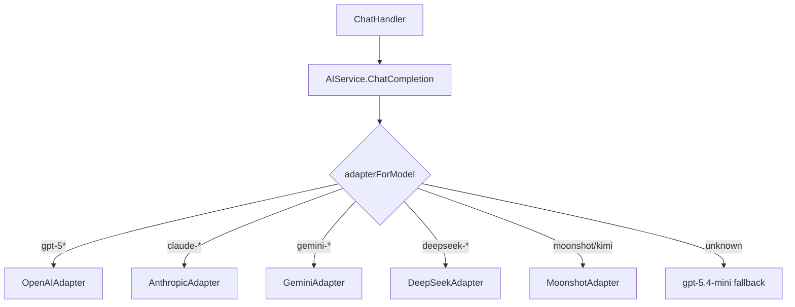
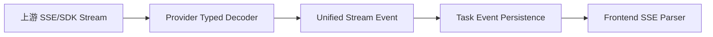

# 模型 Provider 与 SSE 解码架构

## 一、定位

Provider 架构负责把不同模型厂商的 API 差异收敛到统一业务接口。业务层不应知道 OpenAI Responses、Gemini SDK、DeepSeek Chat SSE、Anthropic/Moonshot 的细节。

## 二、核心接口

`UnifiedAIRequest` 是业务层唯一请求结构：

```go
type UnifiedAIRequest struct {
    Model string
    Messages []Message
    Stream bool
    Reasoning bool
    ReasoningEffort ReasoningEffort
    Search bool
    TextFormat map[string]any
}
```

`ProviderAdapter` 是厂商适配接口：

```go
type ProviderAdapter interface {
    Name() string
    Supports(model string) bool
    ChatCompletion(ctx context.Context, req UnifiedAIRequest) (*AICompletionResponse, error)
}
```

## 三、Provider 分派



## 四、当前实现矩阵

| Provider | 触发模型 | 调用方式 | 说明 |
|---|---|---|---|
| OpenAI | `gpt-5*` | Responses API / SDK | 官方模型直连官方 API，支持 native file/image、background |
| Anthropic | `claude-*` | Anthropic API | 通过 Adapter 封装 |
| Gemini | `gemini-*` | Gemini SDK | 独立 SDK stream decoder |
| DeepSeek | `deepseek-*` | HTTP/SSE | 独立 typed stream decoder，避免通用解析不兼容 |
| Moonshot/Kimi | `moonshot-*`, `kimi*` | Moonshot API | 兼容 Kimi 系列 |

## 五、OpenAI 特殊路径

OpenAI 官方模型使用 Responses API，并且强制直连 `https://api.openai.com`，避免误走中转。它还承担两个特殊能力：

1. **Native input**：当前附件可以以 `input_image` / `input_file` 直接传给模型。
2. **Background**：GPT 5.5 / Pro 等复杂模型可能走 background response，需要保存 response id 并通过 webhook/retrieve 继续完成。

## 六、流式解码层



要求：

- reasoning 必须统一为 `<think>...</think>` 或等价结构后再进入前端。
- 搜索来源、usage、error、done 等 meta 事件不能混入正文。
- 每个 Provider 的特殊字段应在 decoder 内消化，不能扩散到 ChatHandler。

## 七、后台任务模型

支持 `ResponseRetriever` 的 Provider 可以把远端后台任务重新 retrieve。本地层需要记录：

- provider task id / response id
- 本地 assistant message id
- 状态：running / completed / failed / cancelled
- 事件序号 seq
- 最终 usage 和成本

## 八、架构约束

1. 新增模型只改 `modelmeta`、Adapter、decoder，不改聊天业务主流程。
2. Provider 差异不得进入前端；前端只消费统一事件。
3. 搜索、reasoning、native file input 这类能力要通过 capability 判断开启。
4. 结构化输出 `TextFormat` 只在支持的 Provider 生效，其他 Provider 应安全忽略或报明确错误。
