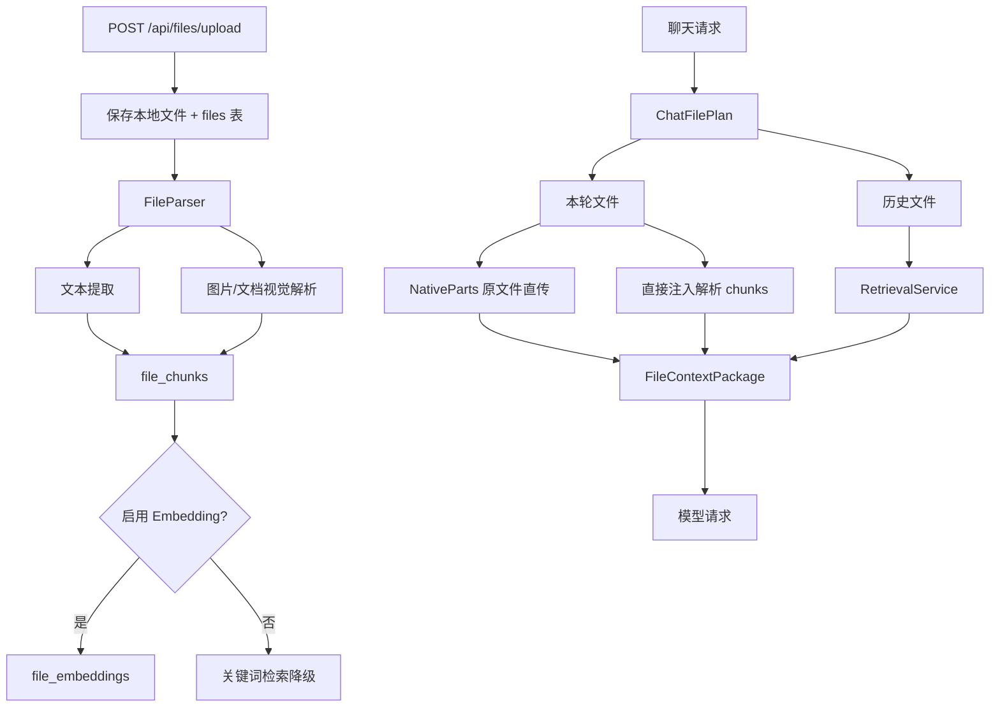

# 文件上传解析与 RAG 架构

## 一、定位

文件架构负责将用户上传的文件转为模型可用上下文。当前设计不是单一路径，而是 Direct-First + 解析文本 + 历史 RAG + 视觉兜底共存。

## 二、核心链路

## 三、文件上下文包

`FileContextPackage` 输出三类内容：

| 字段 | 说明 |
|---|---|
| `SystemPrompt` | `<file_context>` 文本上下文，包含 current/historical/warnings |
| `NativeParts` | 可直传给支持模型的 image/file data URI |
| `Warnings` | 文件未解析、过大、读取失败等提示 |

## 四、Current Files 与 Historical Files

| 类型 | 来源 | 处理策略 |
|---|---|---|
| Current files | 用户本轮上传/附加 | 优先级最高；能原生直传就直传，另有解析文本兜底 |
| Historical files | 会话历史文件池 | 作为补充；通过 RAG/关键词检索召回 |

关键原则：回答文件问题时必须优先依据 current_files，不能把历史文件误当成本轮上传文件。

## 五、Native Direct-First

当模型支持 native vision 或 native file input 时：

- 图片小于限制：读取原图，转 data URI，作为 `input_image` 传入。
- 文件小于限制且模型支持类型：读取原文件，转 data URI，作为 `input_file` 传入。
- 超限或读取失败：加入 warning，回退解析文本。

这保证当前上传文件尽可能被模型直接理解，同时解析/RAG 作为兜底和历史能力。

## 六、Embedding 降级

`NewRouter` 中只有在 `ENABLE_TEXT_EMBEDDING` 且 API Key 存在时才初始化 embedding provider。失败不阻塞启动，自动降级到关键词检索。

收益：

- 开发/低配环境也能跑。
- Embedding provider 不稳定时不影响基础聊天。
- 历史文件召回质量随配置增强。

## 七、前端体验要求

文件 UI 需要明确展示：

1. 上传中。
2. 解析中。
3. 可用于当前对话。
4. 可用于历史检索。
5. 失败/部分可用/warning。

否则用户会把「解析没完成」理解成「聊天卡住」。

## 八、风险点

| 风险 | 影响 | 建议 |
|---|---|---|
| 历史文件污染当前文件 | 回答引用错文件 | current_files 和 historical_files 分区注入 |
| 原文件直传过大 | 请求体爆炸/超时 | 25MB 限制 + warning + 文本回退 |
| Embedding 失败阻塞启动 | 服务不可用 | 保持关键词降级 |
| 前端无解析状态 | 用户误判卡顿 | 文件状态组件化 |
