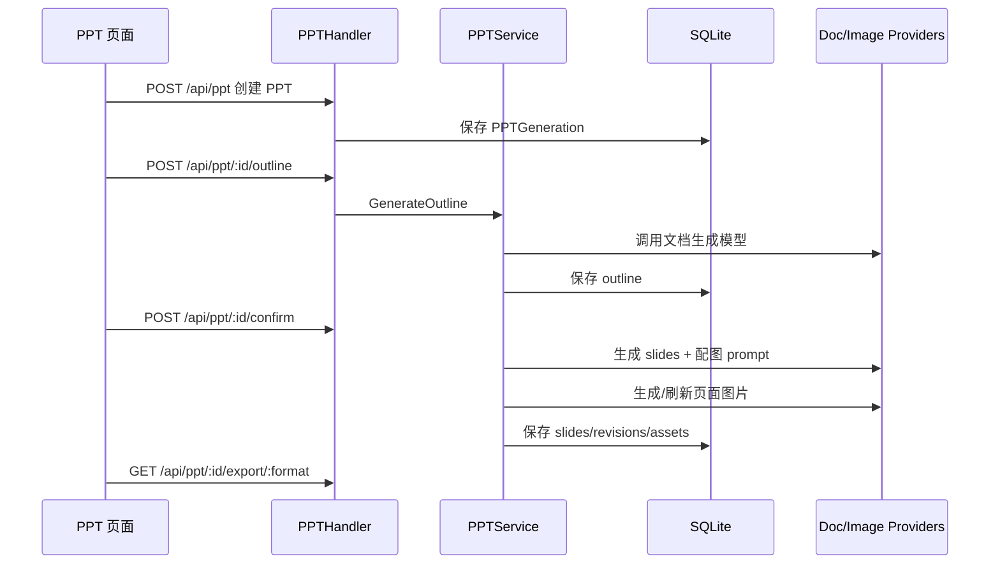

# PPT 文档生成架构

## 一、定位

PPT 架构负责从主题/内容生成结构化演示文稿，并支持提纲确认、幻灯片改写、配图重绘和导出。它属于文档生产力能力，不应和普通聊天消息混在一起。

## 二、核心模块

| 组件 | 文件 | 责任 |
|---|---|---|
| PPTHandler | `backend/internal/api/ppt.go` | HTTP 接口、状态查询、导出 |
| PPTService | `backend/internal/services/ppt_service.go` | 提纲、slides、配图、导出编排 |
| PPT Models | `backend/internal/models/ppt.go` | 模板、生成记录、幻灯片、修订 |
| 前端页面 | `frontend/app/(main)/(app)/ppt/page.tsx` | PPT 工作台 UI |

## 三、生成链路

## 四、数据模型

| 表 | 说明 |
|---|---|
| `ppt_templates` | 模板定义 |
| `ppt_generations` | 一次 PPT 生成任务 |
| `ppt_slides` | 每页幻灯片内容、状态、图片 |
| `ppt_revisions` | 改写/调整历史 |

## 五、状态设计

PPT 不是简单请求/响应，需要明确阶段状态：

1. draft：创建但未生成提纲。
2. outlining：生成提纲中。
3. outline_ready：等待用户确认。
4. generating：生成 slides/配图中。
5. ready：可编辑/导出。
6. failed：失败，可重试。

## 六、和图片服务的关系

PPT 配图可以复用图片生成能力，但应保持独立配置：

- 图片创作页追求用户可控创意。
- PPT 配图追求和 slide 内容、版式统一。
- PPT 图片失败不应导致整份 PPT 不可编辑，应允许单页重绘。

## 七、前端体验重点

- 提纲确认是关键分界点，用户确认前不要消耗大量生成成本。
- 每页 slide 应独立 loading/error/retry。
- 导出按钮只在 ready 或部分 ready 状态出现。
- 长任务不要阻塞整个页面，应显示阶段进度。

## 八、风险点

| 风险 | 影响 | 建议 |
|---|---|---|
| PPT 长任务占用请求 | 超时 | 后续改后台任务事件化 |
| 单页失败拖垮整份 PPT | 体验差 | 单页级 retry 和状态 |
| 配图成本不可控 | 成本飙升 | 限制页数/质量/并发，记录 usage |
