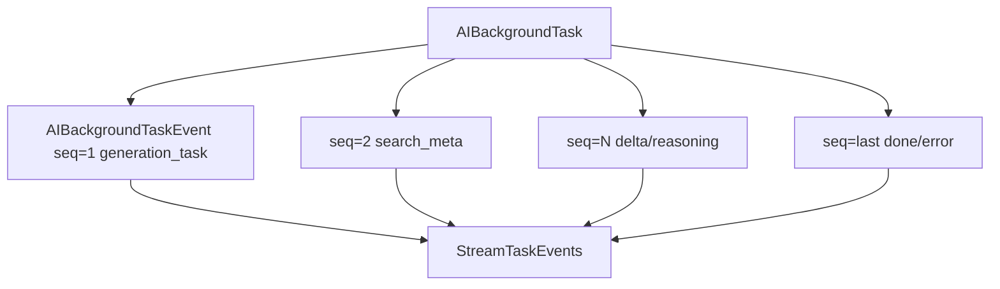

# 数据存储与任务事件架构

## 一、定位

AI Pool 当前以 SQLite + GORM 为主存储，适合单机轻量部署。系统通过 WAL、单连接和事件表支撑聊天流式、文件、媒体、PPT、用量等数据。

## 二、数据库初始化

`InitDB` 做了以下事情：

- 创建数据库目录。
- 使用 SQLite + GORM 打开连接。
- 设置 WAL：`journal_mode=WAL`。
- 设置 `synchronous=NORMAL`、cache、temp_store。
- 限制 `MaxOpenConns=1`，避免 SQLite 写锁争用。
- AutoMigrate 核心模型。
- 执行一次性迁移：MessageGroup、收藏去重、文件 PublicID。

## 三、核心模型分组

| 分组 | 表/模型 |
|---|---|
| 用户与会话 | `User`, `Conversation`, `Message`, `ConversationShare` |
| 对比与收藏 | `CompareRecord`, `MessageGroup`, `MessageFavorite` |
| 文件 | `File`, `FileChunk`, `FileEmbedding`, `FileEmbeddingJob`, `ConversationFile`, `MessageFile` |
| 任务事件 | `AIBackgroundTask`, `AIBackgroundTaskEvent` |
| PPT | `PPTTemplate`, `PPTGeneration`, `PPTSlide`, `PPTRevision` |
| 媒体 | `ImageChat`, `ImageChatMessage`, `VideoGeneration`, video/image handlers 自迁移 |
| 商业化 | `APIUsageLog`, user credits fields |
| 工作区/技能 | `Workspace`, `UserSkill` |

## 四、任务事件表模式

任务事件是聊天流式架构的核心，不只是日志。它承担：

- 断线重连的数据源。
- 前端刷新恢复的数据源。
- 本地 SSE 输出的数据源。
- DONE/error/usage/search meta 的顺序控制。

## 五、本地文件存储

| 类型 | 存储 |
|---|---|
| 用户上传文件 | `FILE_STORAGE_DIR`，默认 `./uploads` |
| 图片生成资产 | 图片 assets 目录，通过 `/api/images/file/:filename` 访问 |
| 视频生成资产 | 视频 assets 目录，通过 `/api/videos/file/:filename` 访问 |

数据库保存元信息和 URL，文件系统保存二进制内容。

## 六、未来迁移边界

| 当前 | 未来可替换 |
|---|---|
| SQLite | Postgres/MySQL |
| 本地文件 | S3/R2/OSS 对象存储 |
| AIBackgroundTaskEvent | Redis Stream / Kafka / Postgres notify |
| 本地 goroutine | 队列 worker |
| 关键词/SQLite 向量 | 专用向量库 |

## 七、风险点

| 风险 | 影响 | 建议 |
|---|---|---|
| 高频事件写 SQLite | 写锁/卡顿 | 合并小 chunk、批量写、降低事件频率 |
| 文件系统和 DB 不一致 | 资产丢失/孤儿文件 | 删除记录时清理文件，定期巡检 |
| AutoMigrate 过多副作用 | 启动不可控 | 复杂迁移拆为显式 migration |
| 单连接 SQLite | 并发受限 | 中长期迁移 Postgres |
