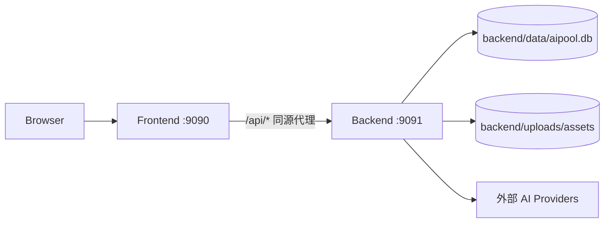

# 部署运行与网关架构

## 一、定位

部署运行架构定义 AI Pool 在当前单机环境中的启动、端口、代理和目录约束。该文档只描述架构，不替代具体运维脚本。

## 二、当前端口与目录

| 服务 | 端口 | 工作目录 | 说明 |
|---|---:|---|---|
| 后端 Go/Gin | 9091 | `/workspace/aipool/backend` | 二进制 `./aipool` 必须在 backend 目录启动 |
| 前端 Next/server | 9090 | `/workspace/aipool/frontend` | `server.js` 在 frontend 下启动 |
| 浏览器访问 | 9090 | - | 前端同源代理 `/api` 到后端 |

## 三、请求路径

前端代码中 `API_BASE_URL = ""`，表示所有接口使用相对路径。这样可以统一走同域代理，避免 CORS、Cookie session、部署域名不一致的问题。

## 四、配置来源

后端通过 `.env` / 环境变量加载配置，包含：

- 服务基础：PORT、DATABASE_PATH、BASE_URL、FRONTEND_URL。
- Chat Provider：OpenAI、Anthropic、Gemini、DeepSeek、Moonshot。
- Vision、Embedding、ImageGen、DocGen、PPTImageGen、VideoGen。
- 匿名限制、价格、输出 token 上限。
- 文件存储目录。

注意：架构文档不记录任何真实 Key 或敏感值。

## 五、网关/代理要求

- `/api/*` 代理到后端 9091。
- `/api/images/file/*`、`/api/videos/file/*` 属于高频媒体读取，需要允许缓存/大文件传输。
- SSE 路由必须关闭缓冲，保持长连接。
- 上传/视频下载路径需要合理 body size 和 timeout。

## 六、运行约束

1. 不要在仓库根目录启动后端二进制；相对路径依赖 backend 工作目录。
2. 不要绕过既有脚本直接乱杀/乱启服务；先看项目脚本。
3. 数据库查询如果涉及 WAL/SHM，需要复制三件套后再离线分析。
4. 前端构建产物和浏览器缓存会影响 UI 验证，修复 UI bug 后必须实际浏览器确认。

## 七、未来部署演进

| 阶段 | 形态 |
|---|---|
| 当前 | 单机 SQLite + 本地文件 + 前后端端口代理 |
| 下一步 | Nginx/Caddy 正式反代 + systemd/supervisor 管理 |
| 扩展 | Postgres + 对象存储 + worker 队列 |
| 商业化 | 独立 API 网关、用户级限流、成本审计、监控告警 |
